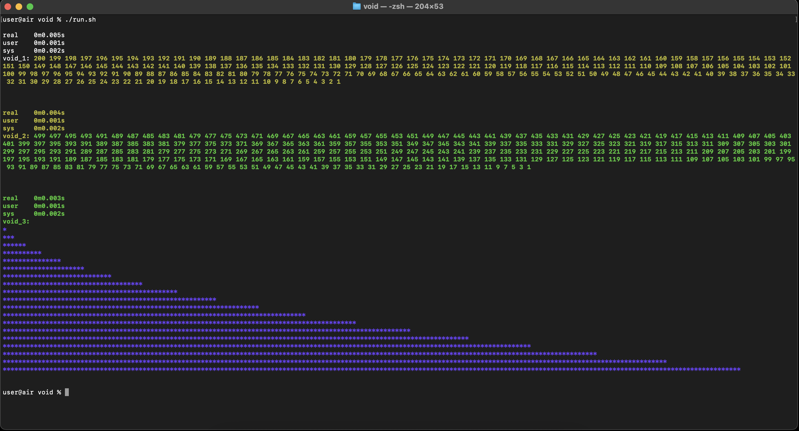

# VOID

## Several examples of void type usage in ANSI C99

## Code

* [Prints a set of numbers from N to 1](https://github.com/ksukhorukov/void/blob/master/src/void_1.c)
* [Prints odd or even numbers starting from N down to 1](https://github.com/ksukhorukov/void/blob/master/src/void_2.c)
* [Prints Tsunami from N layers](https://github.com/ksukhorukov/void/blob/master/src/void_3.c)
* [Anime](https://github.com/ksukhorukov/void/blob/master/src/void_4.c)

## Runner

```
./run.sh
```


